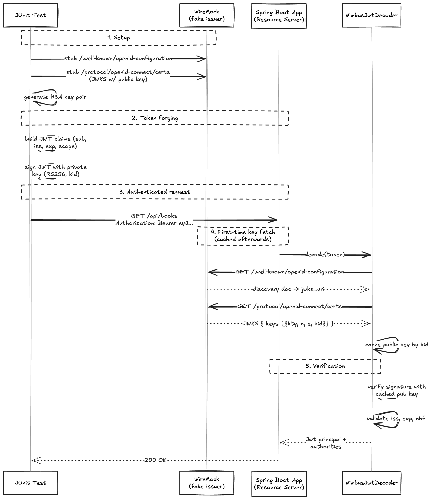

---

<!-- _class: title -->


# Effective Spring Boot Testing Beyond Code Coverage


## Full-Day Workshop

_Spring I/O Conference Workshop 13.04.2026_

Philip Riecks — [PragmaTech GmbH](https://pragmatech.digital/) — [@rieckpil](https://x.com/rieckpil)

--- 

<!-- header: 'Effective Spring Boot Testing Beyond Code Coverage @ Spring I/0 2026' -->
<!-- footer: '' -->

# Organization

- Hotel WiFi: `Spring I/O` Password: `bootifulBCN`

- Workshop lab requirements
  - Hardware: A personal or company laptop.
  - Development Environment: A Java IDE of your choice with Java 21
  - Access to a functional Docker Engine compatible with Testcontainers.
  - Fallback Access: A personal GitHub account for GitHub Codespaces if local setup fails.


---


# Workshop Timeline

- 9:00 - 10:45: **Lab 1 - Writing Reliable Spring Boot Integration Tests Part I** 
- 10:45 - 11:05: **Coffee Break** (20 minutes)
- 11:05 - 13:00: **Lab 1 - Writing Reliable Spring Boot Integration Tests Part 2**
- 13:00 - 14:00 **Lunch** (60 minutes)
- 14:00 - 15:30: **Lab 3 - Accelerating Spring Boot Build Times**
- 15:30 - 15:50 **Coffee Break** (20 minutes)
- 15:50 - 17:00: **Lab 4 - Pitfalls & Best Practices, Time for Q&A**

---


## Workshop Instructor: Philip

- Self-employed IT consultant from Herzogenaurach, Germany (Bavaria) 🍻
- BBlogging & content creation with a focus on testing Java and specifically Spring Boot applications 🍃
- Founder of PragmaTech GmbH - Enabling Developers to Frequently Deliver Software with More Confidence 🚤
- Enjoys writing tests (sometimes even more than production code) 🧪

---

## Getting to Know Each Other

- What's your name and where are you from?
- What's your role in your team?
- What's the biggest Spring Boot testing challenge in your team/organization?
- What's your expectation for this workshop?

---


# Workshop Goals Revisited


- Confidently use Testcontainers for database and infrastructure testing
- Understand and optimize Spring context caching behavior
- Apply proven strategies for testing external service integrations
- Use mutation testing to identify weak spots in your test suite
- Reduce test execution time without sacrificing quality

---

# Move beyond *code coverage* - write tests that give you confidence to ship frequently to production.

---

# Workshop Technical Agenda Revisited

- Test slices and context management in Spring Boot
- Testcontainers: setup, configuration, and best practices 
- Context caching strategies for faster test suites
- Testing external services: WireMock, contract testing, and resilience verification
- Mutation testing with PIT: measuring real test effectiveness
- Performance optimization and test organization patterns

---

## Our Sample Application - Bookshelf

- A sample Library Management System
- Spring Boot 4 / Java 21
- CRUD API for **books** (Postgres + Flyway + JPA)
- **OAuth2 Resource Server** (Keycloak as an identity provider)
- Simple vanilla TypeScript frontend
- Calls the **OpenLibrary** REST API to enrich book metadata on creation
- **Sends an email** via Spring Mail when a book is **deleted**

---


---

## Application Setup & Demo

- Go to menti.com and enter code `7854 8520`
- Clone the repository locally
- Open the project at the root inside your IDE
- Each lab has a dedicated folder within `labs/`
- The code that I show during the labs is in the `experiment` package, your tasks in `exercises` and solutions in `solutions`
- Fallback: Use GitHub Codespaces if you have trouble with local setup

---


## Quick Spring Boot Testing Recap


---

## Spring Boot Test Types


## Sliced Testing with Spring Boot

Verify specific layers of your Spring Boot application with a minimal `ApplicationContext`.

---


---


---


---


---


## The Problem: A Full `@SpringBootTest` Won't Even Start

```java
@SpringBootTest
class Lab1ApplicationIT {
  @Test void contextLoads() {}
}
```

Fails because the app needs:

- A **PostgreSQL** database
- An **SMTP** server (Mailpit) for the deletion notification
- An **OAuth2 issuer** (Keycloak) to validate JWTs

Mocking all of these is fragile and unrealistic.

---

## Challenges when Starting the Entire `ApplicationContext`

- **Problem #1**: How to ensure surrounding infrastructure (e.g. database, queues, etc.) is present?
- **Problem #2**: How to handle HTTP communication from our application to remote services?
- **Problem #3**: How to keep our build time at a reasonable duration?

---


## Solving Problem #1 for our database: In-Memory vs. Real Database

- By default, Spring Boot tries to autoconfigure an in-memory relational database (H2 or Derby)
- In-memory database pros:
  - Easy to use & fast
  - Less overhead
- In-memory database cons:
  - Mismatch with the infrastructure setup in production
  - Despite having compatibility modes, we can't fully test proprietary database features

---


## Testcontainers to the Rescue!

> *"Throwaway, Docker-backed instances of real services for integration tests."*

```java
static PostgreSQLContainer<?> postgres = new PostgreSQLContainer<>("postgres:16-alpine");
```

- Java library that manages **Docker containers** from inside Java code
- Container lifecycle is tied to the test: starts before, stops after
- `static` containers are shared across all tests in the class (faster)
- [Modules](https://testcontainers.com/modules/) for PostgreSQL, MySQL, Redis, Kafka, LocalStack, and more
- Eliminates the "works on my machine" database problem

---

## Testcontainers 101

- Running infrastructure components (databases, message brokers, etc.) in Docker containers for our tests becomes a breeze with [Testcontainers](https://testcontainers.com/)
- Testcontainers abstracts the rather low-level Docker Java API and provides a fluent, Java-friendly API to define and manage containers in our tests
- Whatever you can containerize, you can test with Testcontainers

Testcontainers maps the container's internal ports to random ephemeral ports on the host machine to avoid conflicts.

You can see the mapped ports with `docker ps`:

```shell {3}
$ docker ps
CONTAINER ID   IMAGE                        COMMAND                  CREATED          STATUS         PORTS                                           NAMES
a958ee2887c6   postgres:16-alpine           "docker-entrypoint.s…"   10 seconds ago   Up 9 seconds   0.0.0.0:32776->5432/tcp, [::]:32776->5432/tcp   affectionate_cannon
ad0f804068dc   testcontainers/ryuk:0.12.0   "/bin/ryuk"              10 seconds ago   Up 9 seconds   0.0.0.0:32775->8080/tcp, [::]:32775->8080/tcp   testcontainers-ryuk-1f9f76a6-46d4-4e19-85c1-e8364da12804
```

---

## Testcontainers & Spring Boot Integration

```java {2,5,6}
@DataJpaTest
@Testcontainers
class BookRepositoryTest {

  @Container
  @ServiceConnection
  static PostgreSQLContainer<?> postgres =
      new PostgreSQLContainer<>("postgres:16-alpine");

}
```

- `@Testcontainers` hooks the container into the JUnit 5 extension lifecycle
- `@ServiceConnection` reads host/port from the running container and **auto-configures** Spring's datasource - no manual URL wiring needed

---

## Alternative Connection Configuration

Alternatively, we can use `@DynamicPropertySource` to programmatically set properties from the container:

```java
static PostgreSQLContainer<?> database =
  new PostgreSQLContainer<>("postgres:17.2")
    .withDatabaseName("test")
    .withUsername("duke")
    .withPassword("s3cret");

@DynamicPropertySource
static void properties(DynamicPropertyRegistry registry) {
  registry.add("spring.datasource.url", database::getJdbcUrl);
  registry.add("spring.datasource.password", database::getPassword);
  registry.add("spring.datasource.username", database::getUsername);
}
```

---


## Dynamic Properties — When You Still Need Them

```java

```

Use this for containers without a `@ServiceConnection` factory (yet).

---

## Mailpit as a Test SMTP Server

```java
static GenericContainer<?> mailpit =
    new GenericContainer<>("axllent/mailpit:v1.20")
        .withExposedPorts(1025, 8025)
        .withEnv("MP_SMTP_AUTH_ACCEPT_ANY", "1")
        .withEnv("MP_SMTP_AUTH_ALLOW_INSECURE", "1");
```

- Port `1025` — SMTP receiver
- Port `8025` — HTTP UI Inbox of received emails

```
@DynamicPropertySource
static void mailProps(DynamicPropertyRegistry registry) {
  registry.add("spring.mail.host", mailpit::getHost);
  registry.add("spring.mail.port", () -> mailpit.getMappedPort(1025));
}
```

---

## What About Keycloak?

- As our application acts as an OAuth2 Resource Server, we need a running Keycloak instance to validate JWTs
- During application startup and then frequently during runtime, Spring will try to fetch the OpenID configuration from Keycloak's well-known endpoint (`/.well-known/openid-configuration`) to discover the issuer's public keys and other metadata
- When writing integration tests, we need a valid JWT that signature can be validated against




---


## Container Lifecycle Strategies

- **Per-test class** — `@Testcontainers` + non-static `@Container`
- **Per-JVM (singleton)** — `static` field, manual `start()`
- **Spring-managed** — `@ServiceConnection` + `@Bean` in a `@TestConfiguration`

We'll revisit performance trade-offs in **Lab 3**.

---

## Local Dev with Testcontainers

`spring-boot-docker-compose` and `SpringApplication.from(...).with(TestcontainersConfig.class)` let you boot the app **locally** against the same containers your tests use.

→ Same setup for `mvnw spring-boot:test-run` and the IDE debugger.

---

# Time For Some Exercises
## Lab 1

- Set up the [repository](https://github.com/PragmaTech-GmbH/effective-spring-boot-testing-beyond-code-coverage-workshop) locally
- Work locally or use GitHub Codespaces (120 hours/month free)
- Fore Codespaces, pick at least 4-Cores (16 GB RAM) and region `Europe West`
- Navigate to the `labs/lab-1` folder in the repository and complete the tasks as described in the `README` file of that folder
- Time boxed until the end of the coffee break (11:05 AM)
