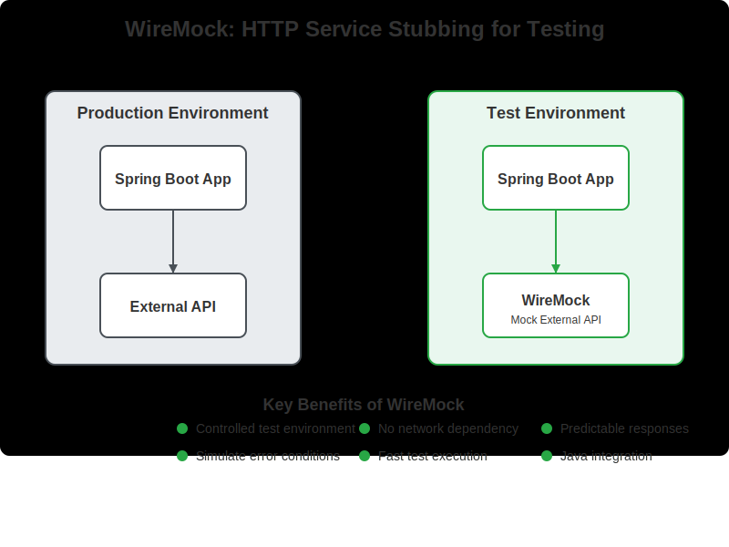

---

<!-- _class: title -->


# Effective Spring Boot Testing Beyond Code Coverage

## Full-Day Workshop

_Spring I/O Conference Workshop 13.04.2026_

Philip Riecks | [PragmaTech GmbH](https://pragmatech.digital/) | [@rieckpil](https://x.com/rieckpil)

---

<!-- header: 'Effective Spring Boot Testing Beyond Code Coverage' -->
<!-- footer: '' -->

## Discuss Exercises from Lab 1

- Integration test including email notification: `ExerciseDeleteBookSendsEmailIT`
  - Setup three containers with Testcontainers
  - Prepare data for the test
  - (Optional) Verify the email was received at Mailpit

---


## Recap of Lab 1

- We explored why testing matters and how good tests give us **confidence to ship frequently**
- We set up our Bookshelf sample application and understood its moving parts: Postgres, Keycloak, Mailpit, OpenLibrary
- We learned that `@SpringBootTest` alone won't start when the app depends on external infrastructure
- We introduced **Testcontainers** to provide real Docker-backed instances of Postgres, Keycloak, and Mailpit
- We wrote our first integration test: delete a book and verify the notification email arrived at Mailpit

---

# Lab 2

## Writing Reliable Spring Boot Integration Tests Part II

---

## The Next Problem: External HTTP Calls

When creating a new book with HTTP POST `/api/books`, our `BookService.createBook` calls **OpenLibrary** to enrich metadata :

```java
BookMetadata metadata = openLibraryApiClient.fetchMetadataForIsbn(isbn);
```

In tests we want to:

❌ Avoid test failures when the remote API is **unreachable** (CI, airplane mode)
❌ Tests becoming **non-deterministic** - dependent on external state and sample data
✅ Control responses, including failures and timeouts

---

## HTTP Communication During Tests

- Unreliable when performing real HTTP calls during tests
- Sample data - what if the remote API changes its response?
- Authentication - real API keys in CI pipelines?
- Cleanup - data written to external systems
- No airplane-mode testing possible

---


## Why Offline / Airplane Mode Matters

- Tests should pass **anywhere**: laptop, CI/CD pipeline, air-gapped environments
- Real network calls make tests:
  - **Slow** - latency accumulates across a large suite
  - **Flaky** - rate limits, API downtime, responses that change over time
  - **Insecure** - credentials leak into logs, data written to external systems
- **Rule:** no test should require an outbound network connection

---


## Solution: HTTP Response Stubbing

Introducing **WireMock**

> *"Simulate APIs. Ship Faster. WireMock is the industry standard for scalable API simulation."*

- In-memory (or Docker container) Jetty to stub HTTP responses to simulate a remote HTTP API
- Simulate failures, slow responses, etc.
- Alternatives: MockServer, MockWebServer, etc.

```java
WireMockServer wireMockServer = new WireMockServer(wireMockConfig().dynamicPort());
wireMockServer.start();
```

---



---

## Stubbing a Response

Stubbing a response with WireMock almost feels like working with Mockito:

```java {2,3,5}
wireMockServer.stubFor(
  WireMock.get(urlPathEqualTo("/api/books")) // <- match the path
    .withQueryParam("bibkeys", WireMock.equalTo("ISBN:" + isbn)) // <- match the query params
    .willReturn(
      aResponse()  // <- define the HTTP response
        .withHeader("Content-Type", MediaType.APPLICATION_JSON_VALUE)
        .withBodyFile(isbn + "-success.json")))
);
```

Static response files go into `src/test/resources/__files/` by default, but we can also define the body inline with `withBody(...)`.

---

## Important Prerequisite: Configurable Base URL

```java
@Value("${book.metadata.api.url:https://openlibrary.org}") 
String baseUrl;

@Value("${book.metadata.api.timeout:5}") 
int timeoutSeconds;

@Bean
public WebClient openLibraryWebClient() {

  // ...

  return WebClient.builder()
    .baseUrl(baseUrl)
    .codecs(configurer -> configurer
      .defaultCodecs()
      .maxInMemorySize(16 * 1024 * 1024)) // 16MB buffer for larger responses
    .build();
}
```

---

## Overriding the Base URL in Tests

```java
// unit tests
new OpenLibraryApiClient(WebClient.builder().baseUrl(wireMockServer.baseUrl()).build());

// integration tests
@DynamicPropertySource
static void overrideOpenLibraryBaseUrl(DynamicPropertyRegistry registry) {
  registry.add("book.metadata.api.url", WIREMOCK::baseUrl);
}

// or
TestPropertyValues.of(
  "book.metadata.api.url=http://localhost:" + WIREMOCK.baseUrl()
).applyTo(applicationContext);
```

---


## WireMock: Advanced Features

**Stateful scenarios** - simulate retry / eventual consistency

```java
wireMockServer.stubFor(get("/isbn/123")
  .inScenario("retry").whenScenarioStateIs(STARTED)
  .willReturn(serverError())
  .willSetStateTo("recovered"));

wireMockServer.stubFor(get("/isbn/123")
  .inScenario("retry").whenScenarioStateIs("recovered")
  .willReturn(ok().withBodyFile("123-success.json")));
```

---

**Response templating** - inject request values into the response body

```java
wireMockServer.stubFor(get(urlPathMatching("/users/.*"))
  .willReturn(aResponse()
    .withHeader("Content-Type", "application/json")
    .withBody(
        {
          "id": "{{request.pathSegments.[1]}}",
          "userAgent": "{{request.headers.User-Agent}}",
          "timestamp": "{{now format='yyyy-MM-dd'}}"
        }
       )
    .withTransformers("response-template")));
```

---

**Proxying & Recording** - record real API responses once, replay offline

```java
wireMockServer.startRecording(RecordSpec.forTarget("https://openlibrary.org/")
    .makeStubsPersistent(true)
    .build());

// ... make real requests ...

wireMockServer.stopRecording();
```

---

## Replacing Keycloak with WireMock for a simulated IdP


---

## Replacing Keycloak with WireMock for a simulated IdP

- Generate an RSA key pair (public key to verify, private key to sign) in the test
- Stub the necessary OAuth 2 discovery call (e.g. `/.well-known/openid-configuration`) with WireMock
- Sign tokens locally - the `NimbusJwtDecoder` fetches & caches our public key
- Faster than Keycloak (no container), but not exercising a real IdP
- Introducing the concept of stub classes to outsource stubbing logic (see `OAuth2Stubs`)

---

## Using `@SpringBootTest` to Start the Entire Context

To start the Servlet Container or not?

We can control the web environment of our context setup with `@SpringBootTest`:

```java
@SpringBootTest                                                // MOCK (default)
@SpringBootTest(webEnvironment = WebEnvironment.RANDOM_PORT)   // real HTTP, random port
@SpringBootTest(webEnvironment = WebEnvironment.DEFINED_PORT)  // real HTTP, static port
@SpringBootTest(webEnvironment = WebEnvironment.NONE)          // no web layer at all
```


---


| Mode | Web server                                    | Real HTTP | Test client                                             |
|---|-----------------------------------------------|---|---------------------------------------------------------|
| `MOCK` *(default)* | Mock servlet environment                      | ❌ | `MockMvc`                                               |
| `NONE` | No servlet                                    | ❌ | none (service/batch tests)                              |
| `RANDOM_PORT` | Real embedded servlet container (e.g. Tomcat) | ✅ | `WebTestClient` / `RestTestClient` / `TestRestTemplate` |
| `DEFINED_PORT` | Real embedded container (e.g. Tomcat)                          | ✅ | `WebTestClient` / `RestTestClient`/ `TestRestTemplate`  |

---

## Variant 1: `MOCK` - No Real Servlet Container, No Real HTTP

- The integration tests starts the entire `ApplicationContext` but **does not start a real HTTP server**
- Instead, it uses `MockMvc` to simulate HTTP requests in a mocked servlet environment, similar to `@WebMvcTest` but with the full context loaded.

```java
@SpringBootTest
@AutoConfigureMockMvc
class BookControllerMockMvcIT {

  @Autowired
  private MockMvc mockMvc;
  
  @Test
  void sampleTest() {
    // test against your entire application, using a mocked servlet environment
  }
}
```

---

## Benefits of `MOCK` Mode

- Both the test and tha controller code run in the same thread, so `@Transactional` tests will roll back changes made by the controller
- Faster than `RANDOM_PORT` since no real HTTP server is started
- We don't need our Keycloak as we can use Spring Security Test (e.g. `SecurityMockMvcRequestPostProcessors.jwt()`) to simulate authenticated requests

---

## Variant 2: `RANDOM_PORT` - Entire Context with Servlet Container

```java
@SpringBootTest(webEnvironment = SpringBootTest.WebEnvironment.RANDOM_PORT)
@AutoConfigureWebTestClient // ... or RestTestClient/TestRestTemplate
class SampleIT {

  @LocalServerPort
  private int port;
  
  @Autowired
  private WebTestClient webTestClient; // <- auto-configured for the random port

  @Test
  void sampleTest() {
    this.webTestClient.get().uri("/api/books").exchangeSuccessfully();
  }
}
```

---

## Differences compared to `MOCK` Mode

- Both the test and tha controller code run in a separate thread, so `@Transactional` tests will roll back changes made by the controller
- We can't use Spring Security Test and have to provide a valid authentication
- We start Tomcat and have our real target environment and get closer to production

---

# Time For Some Exercises
## Lab 2

See `labs/lab-2/README.md`.

1. See `ExerciseCreateBookWireMockIT`
2. Write a full integration test for `POST /api/books` with WireMock stubbing OpenLibrary
3. Use `@SpringBootTest(webEnvironment = WebEnvironment.RANDOM_PORT)` to start the entire context with a real HTTP server
