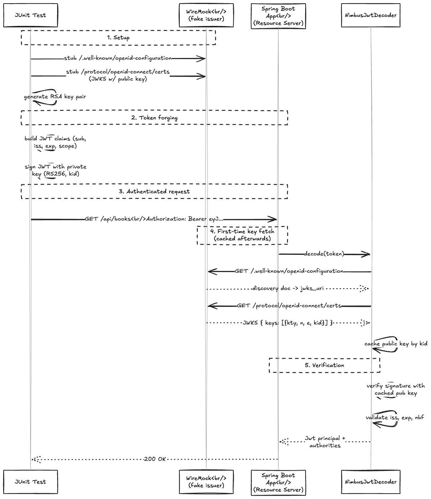

---

<!-- _class: title -->


# Effective Spring Boot Testing Beyond Code Coverage

## Full-Day Workshop

_Spring I/O Conference Workshop 13.04.2026_

Philip Riecks — [PragmaTech GmbH](https://pragmatech.digital/) — [@rieckpil](https://x.com/rieckpil)

---

<!-- header: 'Effective Spring Boot Testing Beyond Code Coverage' -->
<!-- footer: '' -->

## Discuss Exercises from Lab 1

- Integration test including email notification: `ExerciseDeleteBookSendsEmailIT`
  - Setup three containers with Testcontainers
  - Prepare data for the test
  - (Optional) Verify the email was received at Mailpit

---


## Recap of Lab 1

- TBD

---

# Lab 2

## Writing Reliable Spring Boot Integration Tests Part II

---

## The Next Problem: External HTTP Calls

When creating a new book with HTTP POST `/api/books`, our `BookService.createBook` calls **OpenLibrary** to enrich metadata :

```java
BookMetadata metadata = openLibraryApiClient.fetchMetadataForIsbn(isbn);
```

In tests we want to:

❌ Avoid test failures when the remote API is **unreachable** (CI, airplane mode)
❌ Tests becoming **non-deterministic** - dependent on external state and sample data
✅ Control responses, including failures and timeouts

---

## HTTP Communication During Tests

- Unreliable when performing real HTTP calls during tests
- Sample data - what if the remote API changes its response?
- Authentication - real API keys in CI pipelines?
- Cleanup - data written to external systems
- No airplane-mode testing possible

---


## Why Offline / Airplane Mode Matters

- Tests should pass **anywhere**: laptop, CI/CD pipeline, air-gapped environments
- Real network calls make tests:
  - **Slow** - latency accumulates across a large suite
  - **Flaky** - rate limits, API downtime, responses that change over time
  - **Insecure** - credentials leak into logs, data written to external systems
- **Rule:** no test should require an outbound network connection

---


## Solution: HTTP Response Stubbing

Introducing **WireMock**

> *"A simulator for HTTP-based APIs."*

- In-memory (or Docker container) Jetty to stub HTTP responses to simulate a remote HTTP API
- Simulate failures, slow responses, etc.
- Alternatives: MockServer, MockWebServer, etc.
- Stub `GET /api/books/...` with a pre-defined JSON body
- **Verify** which requests our code made

---


---

## Introducing WireMock

- In-memory (or Docker container) Jetty to stub HTTP responses to simulate a remote HTTP API
- Simulate failures, slow responses, etc.
- Alternatives: MockServer, MockWebServer, etc.

```java
WireMockServer wireMockServer = new WireMockServer(wireMockConfig().dynamicPort());
wireMockServer.start();

// Feels a bit like Mockito, but for HTTP stubbing
wireMockServer.stubFor(
  WireMock.get(urlPathEqualTo("/api/books"))
    .withQueryParam("bibkeys", WireMock.equalTo("ISBN:" + isbn))
    .willReturn(
      aResponse()
        .withHeader("Content-Type", MediaType.APPLICATION_JSON_VALUE)
        .withBodyFile(isbn + "-success.json")))
);
```

---

## Important Prerequisite: Configurable Base URL

```java
@Value("${book.metadata.api.url:https://openlibrary.org}") 
String baseUrl;

@Value("${book.metadata.api.timeout:5}") 
int timeoutSeconds;

@Bean
public WebClient openLibraryWebClient() {

  // ...

  return WebClient.builder()
    .baseUrl(baseUrl)
    .codecs(configurer -> configurer
      .defaultCodecs()
      .maxInMemorySize(16 * 1024 * 1024)) // 16MB buffer for larger responses
    .build();
}
```

---

## Overriding the Base URL in Tests

```java
// unit tests
new OpenLibraryApiClient(WebClient.builder().baseUrl(wireMockServer.baseUrl()).build());


```

---


## WireMock: Advanced Features

**Stateful scenarios** - simulate retry / eventual consistency

```java
wireMockServer.stubFor(get("/isbn/123")
  .inScenario("retry").whenScenarioStateIs(STARTED)
  .willReturn(serverError())
  .willSetStateTo("recovered"));

wireMockServer.stubFor(get("/isbn/123")
  .inScenario("retry").whenScenarioStateIs("recovered")
  .willReturn(ok().withBodyFile("123-success.json")));
```

---

**Response templating** - inject request values into the response body

```java
wireMockServer.stubFor(get(urlPathMatching("/users/.*"))
  .willReturn(aResponse()
    .withHeader("Content-Type", "application/json")
    .withBody(
        {
          "id": "{{request.pathSegments.[1]}}",
          "userAgent": "{{request.headers.User-Agent}}",
          "timestamp": "{{now format='yyyy-MM-dd'}}"
        }
       )
    .withTransformers("response-template")));
```

---

**Proxying & Recording** - record real API responses once, replay offline

```java
wireMockServer.startRecording(RecordSpec.forTarget("https://openlibrary.org/")
    .makeStubsPersistent(true)
    .build());

// ... make real requests ...

wireMockServer.stopRecording();
```


## Effective WireMock Usage

```java
@RegisterExtension
static WireMockExtension wm = WireMockExtension.newInstance()
    .options(wireMockConfig().dynamicPort())
    .build();

@DynamicPropertySource
static void apiUrl(DynamicPropertyRegistry r) {
  r.add("book.metadata.api.url", wm::baseUrl);
}
```

---

## Stubbing a Response

```java
wm.stubFor(get(urlPathMatching("/api/books/.*"))
  .willReturn(okJson("""
    { "title": "Effective Java", "covers": [12345] }
  """)));
```

Then assert WireMock was actually called:

```java
wm.verify(getRequestedFor(urlPathEqualTo("/api/books/9780134685991")));
```

---


## Using `@SpringBootTest` to Start the Entire Context

To start the Servlet Container or not?

We can control the web environment of our context setup with `@SpringBootTest`:

```java
@SpringBootTest                                                // MOCK (default)
@SpringBootTest(webEnvironment = WebEnvironment.RANDOM_PORT)   // real HTTP, random port
@SpringBootTest(webEnvironment = WebEnvironment.DEFINED_PORT)  // real HTTP, static port
@SpringBootTest(webEnvironment = WebEnvironment.NONE)          // no web layer at all
```


---


| Mode | Web server                                    | Real HTTP | Test client                                             |
|---|-----------------------------------------------|---|---------------------------------------------------------|
| `MOCK` *(default)* | Mock servlet environment                      | ❌ | `MockMvc`                                               |
| `NONE` | No servlet                                    | ❌ | none (service/batch tests)                              |
| `RANDOM_PORT` | Real embedded servlet container (e.g. Tomcat) | ✅ | `WebTestClient` / `RestTestClient` / `TestRestTemplate` |
| `DEFINED_PORT` | Real embedded container (e.g. Tomcat)                          | ✅ | `WebTestClient` / `RestTestClient`/ `TestRestTemplate`  |

Two variants matter for nearly every integration test: **`MOCK`** and **`RANDOM_PORT`**.


---

## Variant 1: `MOCK` - No Real Servlet Container, No Real HTTP

- The integration tests starts the entire `ApplicationContext` but **does not start a real HTTP server**
- Instead, it uses `MockMvc` to simulate HTTP requests in a mocked servlet environment, similar to `@WebMvcTest` but with the full context loaded.

```java
@SpringBootTest
@AutoConfigureMockMvc
class SampleIT {

  @Autowired
  private MockMvc mockMvc;
  
  @Test
  void sampleTest() {
    // test against your entire application, using a mocked servlet environment
  }
}
```

---

## Variant 2: `RANDOM_PORT` - Entire Context with Servlet Container

```java
@SpringBootTest(webEnvironment = SpringBootTest.WebEnvironment.RANDOM_PORT)
@AutoConfigureWebTestClient // choose one
@AutoConfigureTestRestTemplate // choose one
@AutoConfigureRestTestClient // choose one
class SampleIT {

  @LocalServerPort
  private int port;
  
  @Autowired
  private WebTestClient webTestClient; // <- auto-configured for the random port

  @Test
  void sampleTest() {
    this.webTestClient.get().uri("/api/books").exchangeSuccessfully();
  }
}
```


## WireMock — Advanced Features

- **Response templates** — Handlebars over the request body
- **Proxying** — record real responses, replay them
- **Stateful scenarios** — first call fails, second succeeds (resilience tests)
- **Faults** — connection reset, slow response, malformed body

---

## How to Provide a Valid JWT for an Integration Test

Three options:

1. **`SecurityMockMvcRequestPostProcessors.jwt()`** — only with MockMvc (`MOCK` mode)
2. **`@WithMockUser` / `@WithMockJwtAuth`** — annotation-driven
3. **Real signed JWT** — sign with a test key, point `issuer-uri` at WireMock

We'll use option 3 for **`RANDOM_PORT`** integration tests.

---

## Alternative — Stub the JWKS with WireMock



- Generate an RSA key pair in the test
- Stub `/.well-known/openid-configuration` and `/protocol/openid-connect/certs` on a WireMock server
- Sign tokens locally — the `NimbusJwtDecoder` fetches & caches your fake public key
- Faster than Keycloak (no container boot), but you're not exercising a real IdP

See `experiment/WireMockJwksAuthIT` in lab-2.

---

## OAuth2 Option 3 — Sign a Token Yourself

```java
@TestConfiguration
class TestJwtConfig {
  @Bean JwtDecoder jwtDecoder() {
    return NimbusJwtDecoder.withPublicKey(testPublicKey).build();
  }
}
```

Then in the test:

```java
String token = TestJwtFactory.signed(Map.of("sub", "alice", "scope", "books:write"));
mockMvc.perform(post("/api/books").header("Authorization", "Bearer " + token));
```

---

## The Two Modes of `@SpringBootTest`

| Mode                                  | Servlet | HTTP | Use with                    |
|---------------------------------------|---------|------|-----------------------------|
| `webEnvironment = MOCK` *(default)*   | Mock    | No   | `MockMvc`                   |
| `webEnvironment = RANDOM_PORT`        | Real    | Yes  | `TestRestTemplate` / `WebTestClient` |

`MOCK` is faster and lets `@Transactional` rollback work.
`RANDOM_PORT` is closer to production — needed for filters, async, real auth flows.

---

## `@Transactional` and `RANDOM_PORT`

⚠️ With `RANDOM_PORT`, the test thread and the request thread are **different**. Rollback in the test thread will **not** roll back data committed by the controller.

Use `JdbcTemplate` cleanups or **Testcontainers + database-per-test** instead.

---

## Customising the Test Context

- `@TestConfiguration` — add/replace beans for one test
- `@MockitoBean` — replace a bean with a Mockito mock (Spring Boot 3.4+)
- `@ActiveProfiles("test")` — switch profiles
- `@DynamicPropertySource` — late-bound properties from containers

---

# Time For Some Exercises

See `labs/lab-2/README.md`.

1. Write a full integration test for `POST /api/books` with WireMock stubbing OpenLibrary
2. Provide a valid JWT for the request
3. Pick `MOCK` vs `RANDOM_PORT` — and justify your choice

---

## Recap

- WireMock = your HTTP boundary, controllable and offline
- Three ways to bring auth into a test — pick by mode
- `MOCK` vs `RANDOM_PORT`: faster vs more realistic
- `@Transactional` is **not** a magic cleanup for `RANDOM_PORT`

**Next:** make all this *fast*.
