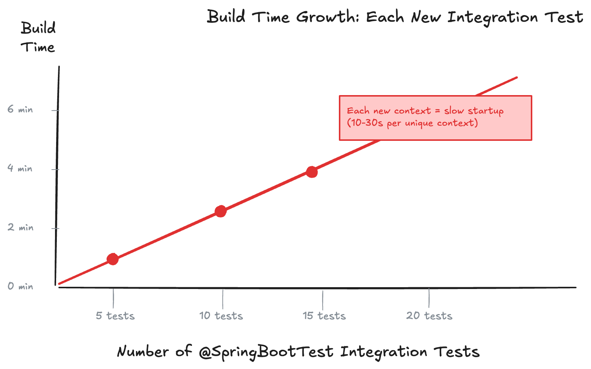
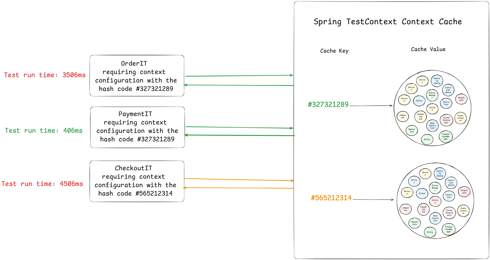

---

<!-- _class: title -->


# Effective Spring Boot Testing Beyond Code Coverage

## Full-Day Workshop

_Spring I/O Conference Workshop 13.04.2026_

Philip Riecks | [PragmaTech GmbH](https://pragmatech.digital/) | [@rieckpil](https://x.com/rieckpil)

---

<!-- header: 'Effective Spring Boot Testing Beyond Code Coverage' -->
<!-- footer: '' -->

## Discuss Exercises from Lab 2

- Integration test including WireMock stubbing: `ExerciseCreateBookWireMockIT`
  - Setup WireMock 
  - Stub the HTTP call to OpenLibrary with a canned response
  - Verify the created book and clean up after the test

---

## Recap of Lab 2

- We tackled the problem of **external HTTP calls** in tests and why real network calls make tests flaky and slow
- We introduced **WireMock** to stub the OpenLibrary API and learned advanced features: stateful scenarios, response templating, proxying & recording
- We replaced Keycloak with a **WireMock-based fake OIDC issuer** (`OAuth2Stubs`) — no container, no startup cost
- We compared **`MOCK` vs `RANDOM_PORT`** modes: MockMvc runs on the test thread (enabling `@Transactional` rollback), while `RANDOM_PORT` starts real Tomcat on a separate thread (requiring explicit cleanup)
- We wrote a full integration test for `POST /api/books` with WireMock stubbing, a real signed JWT, and database assertions

---


# Lab 3

## Accelerating Spring Boot Build Times

---

## Why Do Fast Builds Matter?

Every minute you shave off the feedback loop compounds: across developers, across days, across every commit that still has to be shipped this quarter.

- Short build times unlock **trunk-based development** and multiple deploys per day
- Each merged PR moves value to users sooner - not next week, not next sprint
- Accelerate metrics (DORA) are **dominated by lead time**, and lead time is dominated by pipeline duration
- Fast CI turns "release day" into a non-event - just another deploy

---

## The Cognitive Case: Stay In Flow

- Context switching is the silent productivity killer - every interruption costs **~23 minutes** to recover from
- A slow build is an interruption: you open Slack, read an article, lose the mental model
- Fast builds keep the problem **fresh in your head** - you finish what you started
- Bug fixes stay small because you debug while you still remember what you changed

---

## The Quality Case: Quicker Bug Fixes

- Fast builds are run **more often**, so bugs are caught closer to the commit that introduced them
- Developers who trust the test suite **actually run it** before pushing - slow suites train people to skip it
- Production incidents get shorter MTTR because the fix→verify→deploy loop is seconds, not hours

---

## The Hidden Multiplier

> 10 developers × 20 pushes/day × 5 min saved per run
> **= ~16 engineering hours reclaimed every single day**

That's a full extra engineer's worth of focused work - for free - just by investing in your test infrastructure.

**Lab 3 is about capturing that dividend.**

---

## What to Avoid: Scaling the Build Time linearly with Each New Tests



---

## The Root Cause

Every `@SpringBootTest` context startup costs **multiple seconds**:

- Testcontainers (PostgreSQL) starts → JDBC connection pool opens
- WireMock starts and stubs are registered
- Flyway runs migration scripts
- Spring wires all beans

If 10 test classes each create a **unique** context → **10 cold starts**

---


# Build Time Optimization #1: Spring Test Context Caching

---

## The Solution: Spring Test Context Caching

- Built into Spring Test - available automatically via `spring-boot-starter-test`
- Caches a started `ApplicationContext` by a **cache key**
- Cache is per-JVM process (not shared across forks or CI agents)

Example of speed improvement:


---


---


---



---

### How the Cache is Built

```java
// DefaultContextCache.java
private final Map<MergedContextConfiguration, ApplicationContext> contextMap =
  Collections.synchronizedMap(new LruCache(32, 0.75f));
```

The following information is part of the Cache Key (`MergedContextConfiguration`):

- activeProfiles (`@ActiveProfiles`)
- contextInitializersClasses (`@ContextConfiguration`)
- propertySourceLocations (`@TestPropertySource`)
- propertySourceProperties (`@TestPropertySource`)
- contextCustomizer (`@MockitoBean`, `@MockBean`, `@DynamicPropertySource`, ...)
- etc.

---

### Spring's X-Ray: Building the `MergedContextConfiguration`

Before starting any context, Spring performs an **X-ray scan** of the test class:

1. Walks the class hierarchy and collects every context customisation point:
  - annotations (`@SpringBootTest`, `@ActiveProfiles`, `@TestPropertySource`)
  - `@ContextConfiguration` initializers
  - `@MockitoBean` / `@MockBean` definitions
  - `@DynamicPropertySource` methods
  - ...
2. Merges all collected metadata into a single **`MergedContextConfiguration`** object
3. Computes the **`hashCode`** of that object → this is the cache key

---

```text
Test class
    │
    ▼ 
MergedContextConfiguration {
  testClass, locations, classes,
  activeProfiles, propertyValues,
  contextInitializers, contextCustomizers   ← every @MockitoBean lands here
}
    │
    ▼  hashCode() / equals()
    
Cache hit? → reuse context ✅
Cache miss? → start new context and store it 🆕
```

**Consequence:** even a single extra `@MockitoBean` changes the hash → **new context**.

---


###  Detect Context Restarts - Visually


---

### Detect Context Restarts - with Logs


---

### Detect Context Restarts - with Tooling


An [open-source Spring Test utility](https://github.com/PragmaTech-GmbH/spring-test-profiler) that provides visualization and insights for Spring Test execution, with a focus on Spring context caching statistics.

**Overall goal**: Identify optimization opportunities in your Spring Test suite to speed up your builds and ship to production faster and with more confidence.

---

## Use `@DirtiesContext` with Caution

Developers tend to consult AI/StackOverflow for integration test issues and often copy advice from the internet without knowing the implications:

```java
@SpringBootTest
@DirtiesContext
// this instructs Spring to remove the context from the cache
// and rebuild a new context on every request
public abstract class AbstractIntegrationTest {

}
```

The setup above will **disable** the context caching feature and slow down the builds significantly!

---

## Other Context Cache Killers

| Pattern | Reason |
|---|---|
| `@DirtiesContext` | Destroys the context — forces cold start |
| `@MockitoBean` | Replaces a bean → different cache key |
| `@ActiveProfiles("test")` | Adds a profile → different key |
| `@TestPropertySource(properties = "x=1")` | Extra property → different key |
| `@SpringBootTest(properties = "x=1")` | Extra property → different key |

------

## Sliced Tests Still Matter

- Spring also caches sliced contexts.
- A `@WebMvcTest` or `@DataJpaTest` is a **smaller** context that boots faster *and* caches independently. 
- Use slices when you don't need the full stack.

---

### New in Spring Framework 7: Pausing Contexts

See Release Notes von [Spring Framework 7](https://spring.io/blog/2025/07/17/spring-framework-7-0-0-M7-available-now).

> Pausing of Test Application Contexts
>
> The Spring TestContext framework is caching application context instances within test suites for faster runs. As of Spring Framework 7.0, we now pause test application contexts when they're not used.
>
> This means an application context stored in the context cache will be stopped when it is no longer actively in use and automatically restarted the next time the context is retrieved from the cache.


---

# Build Time Optimization #2: Test Parallelization

---

## Test Parallelization

**Goal**: Reduce build time by running tests concurrently

Two independent mechanisms - they work at different levels:

| Mechanism                                             | Level | Isolation |
|-------------------------------------------------------|---|---|
| Maven Surefire/Failsafe `forkCount` (same for Gradle) | JVM processes | Separate heaps, class loaders |
| JUnit Jupiter parallel execution                      | Threads within one JVM | Shared heap, shared class loader |

These are **complementary** - you can (and should) use both together.

---

## Approach 1: Maven `forkCount` - Process Level

Splits tests across multiple **separate JVM processes**:

```xml
<plugin>
  <artifactId>maven-surefire-plugin</artifactId>
  <configuration>
    <forkCount>1C</forkCount>     <!-- 1 JVM per CPU core -->
    <reuseForks>true</reuseForks> <!-- Reuse JVMs across test classes -->
  </configuration>
</plugin>
```

- `forkCount=1` - default: one JVM for all tests
- `forkCount=2` - two JVMs running in parallel
- `forkCount=1C` - one JVM per available CPU core (dynamic)

> **Maven Failsafe** works the same way for `*IT.java` integration tests.

---

## Approach 2: JUnit Jupiter Parallel - Thread Level

Runs test **classes** (and/or methods) concurrently on threads within one JVM:

```properties
# src/test/resources/junit-platform.properties
junit.jupiter.execution.parallel.enabled = true
junit.jupiter.execution.parallel.mode.default = same_thread
junit.jupiter.execution.parallel.mode.classes.default = concurrent
```

Or configure directly in Maven Surefire:

```xml
<properties>
  <configurationParameters>
    junit.jupiter.execution.parallel.enabled = true
    junit.jupiter.execution.parallel.mode.default = same_thread
    junit.jupiter.execution.parallel.mode.classes.default = concurrent
  </configurationParameters>
</properties>
```

---


---

## JUnit Jupiter Parallelization Strategies Compared

| Strategy | `mode.classes.default` | `mode.default` | Effect |
|---|---|---|---|
| **Safest**  | `concurrent` | `same_thread` | Classes in parallel, methods sequential |
| **Fastest**  | `concurrent` | `concurrent` | Everything in parallel |
| **Sequential**  | `same_thread` | `same_thread` | Fully sequential |

Override per class with `@Execution`:

```java
@Execution(ExecutionMode.CONCURRENT)  // Override global setting for this class
class DiscountServiceTest { ... }
```

---

**Rules for parallel-safe unit tests:**
- No static mutable fields
- No shared service instances across tests
- No `ThreadLocal` usage without guaranteed cleanup
- Don't depend on the test exection order

---

## Integration Tests: Different Challenges

Integration tests share infrastructure: database, WireMock, caches.

**The additional risks with parallel integration tests:**

- Two tests `INSERT` the same ISBN → unique constraint violation
- One test `DELETE`s a record another test expects to find
- `count()` assertions return unexpected results from other tests' inserts
- Testcontainers port conflicts when each class starts its own container

**The approach:** parallelize at the **class** level only (`mode.default = same_thread`), and enforce strong data isolation within each class.

---

## Parallelization: Unit vs. Integration Summary

| | Unit Tests | Integration Tests |
|---|---|---|
| Recommended tool | JUnit parallel + Surefire forks | JUnit class-level parallel |
| Safe `mode.default` | `concurrent` | `same_thread` |
| Safe `mode.classes` | `concurrent` | `concurrent` |
| Key isolation | No shared mutable state | `@Transactional` + unique data |
| `forkCount` | Very beneficial | Be careful with Testcontainers |
| Typical speed gain | 2–4× | 1.5–2× |

**Always measure! Run with and without, compare time.**

---

# Build Time Optimization #3: Correct Usage of Testcontainers

---

## The Naive Approach (and Why It's Slow)

```java
// ❌ Instance @Container — starts AND stops with every test class
@Testcontainers
@SpringBootTest
class BookControllerIT {

  @Container
  PostgreSQLContainer postgres = new PostgreSQLContainer("postgres:16-alpine");
}
```

With 10 integration test classes → **10 container starts × ~5s each = 50s overhead**

---

## The Singleton Pattern: Static @Bean

Spring Boot 3.1+ -   use a `@TestConfiguration` with a `static` factory method:

```java
@TestConfiguration(proxyBeanMethods = false)
public class LocalDevTestcontainerConfig {

  // ✅ static method — container created once, shared across all contexts
  // ✅ @ServiceConnection — no @DynamicPropertySource boilerplate needed
  @Bean
  @ServiceConnection
  static PostgreSQLContainer<?> postgres() {
    return new PostgreSQLContainer<>("postgres:16-alpine")
      .withDatabaseName("testdb")
      .withUsername("test")
      .withPassword("test");
  }
}
```

Use it in every integration test: `@Import(LocalDevTestcontainerConfig.class)`

---


## The Hidden Danger: Connection Pool Exhaustion

Each Spring context has its **own HikariCP connection pool**.

```text
PostgreSQL max_connections = 100  (default)

Context A  →  HikariPool (10 connections each)  ─┐
Context B  →  HikariPool (10 connections each)   ├──▶ 1 Postgres container
Context C  →  HikariPool (10 connections each)   │    (30 connections used)
Context D  →  HikariPool (10 connections each)  ─┘

10th context starts → FATAL: sorry, too many clients already
```

This is why context caching and parallelization work **together** - fewer contexts means fewer connection pools.

---

## Preventing Connection Pool Exhaustion

**Option 1 - Maximize context reuse**:

→ One `AbstractIntegrationTest` → one context → one pool

**Option 2 - Reduce pool size per context:**

```yaml
spring:
  datasource:
    hikari:
      maximum-pool-size: 5   # ↓ down from default 10
```

**Option 3 - Raise PostgreSQL's max_connections:**

```java
new PostgreSQLContainer("postgres:16-alpine")
  .withCommand("postgres", "-c", "max_connections=200");
```

---

## Testcontainers Reuse Mode

Skip container startup entirely between local test runs:

```java
static PostgreSQLContainer<?> postgres = new PostgreSQLContainer<>("postgres:16-alpine")
  .withReuse(true);  // ← Surviving container is reused on next run
```

Requires `~/.testcontainers.properties`:

```properties
testcontainers.reuse.enable=true
```

**Implications:**
- Container keeps its state between runs → good test isolation (`@Transactional`) is critical

---

## Further Testcontainers Optimization Tips

- (CI-relevant) Pre-pull images to avoid rate limits and cold starts, make sure the pulled image is cached in the CI environment
- Use custom Docker images to e.g., pre-create the database schema, reducing startup time
- Start multiple Docker containers in parallel `Startables.deepStart(postgres, kafka).join();`
- Consider [Zonky](https://github.com/zonkyio/embedded-database-spring-test) Embedded Database

---

# Time For Some Exercises

See `labs/lab-3/README.md`.

1. Analyze the test suite and identify how many contexts are created
2. Identify the context cache killers in the test suite and understand why they break caching
3. Reduce the number of contexts to one by applying the `AbstractIntegrationTest` pattern and removing cache killers
