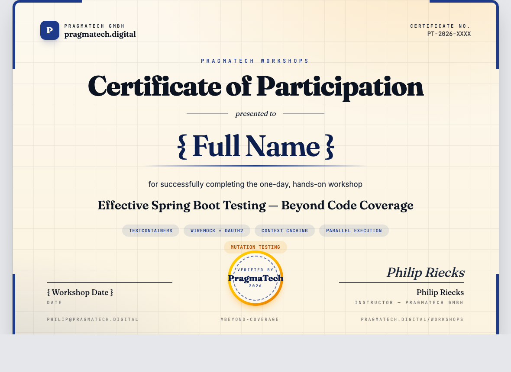

---

<!-- _class: title -->


# Testing Spring Boot Applications Demystified

## Lab 4

_Digdir Workshop 03.03.2026_

Philip Riecks - [PragmaTech GmbH](https://pragmatech.digital/) - [@rieckpil](https://x.com/rieckpil)

---

<!-- header: 'Testing Spring Boot Applications Demystified Workshop @ Digdir 03.03.2026' -->
<!-- footer: '' -->

## Discuss Exercises from Lab 3

- Exercises:
  - `Exercise1ParallelExecutionTest`
  - `Exercise2TestIsolationTest`

---


# Lab 4

## General Spring Boot Testing Tips & Tricks and Q&A

### Various Spring Boot Testing Hacks

---

## `OutputCaptureExtension`

Capture `System.out`, `System.err`, and log output **without** starting a Spring context.

```java
@ExtendWith(OutputCaptureExtension.class)
class OutputCaptureTest {

  private static final Logger log = LoggerFactory.getLogger(OutputCaptureTest.class);

  @Test
  void shouldCaptureStdOutWhenPrintingToSystemOut(CapturedOutput output) {
    System.out.println("hello");

    assertThat(output.getOut()).contains("hello");
  }

  @Test
  void shouldCaptureLogOutputWhenLoggingWithSlf4j(CapturedOutput output) {
    log.info("Book created");

    assertThat(output.getAll()).contains("Book created");
  }
}
```
  
---

## Why Code Coverage Lies

- JaCoCo measures **lines executed**, not **behavior verified**
- Remove every assertion from your tests — coverage stays at 100%

```java
@Test
void shouldReturnFeeWhenBookIsOverdue() {
  BigDecimal fee = cut.calculateFee(borrowedBook, sevenDaysAgo);
  // No assertion at all — JaCoCo still reports this line as "covered"
}
```

- 100% line coverage + zero assertions = **zero confidence**
- We need a tool that checks whether tests actually **detect bugs**

---

## What Is Mutation Testing?


- [PIT](https://pitest.org/) **injects small bugs** (mutants) into your compiled code, then reruns your tests
- **Killed** — at least one test fails, the test suite detected the bug
- **Survived** — all tests still pass, exposing a **gap** in your assertions
- **Mutation Score** = `killed mutants / total mutants x 100`

---

## How PIT Works Internally


1. Analyses **bytecode** of production classes (never touches source)
2. Collects per-test line coverage, selects only **matching tests** per mutant
3. Orders tests by speed — fastest first
4. **Early exit:** stops as soon as the first test kills a mutant

> PIT never modifies your `.java` files — everything happens in memory at the bytecode level.

---

## PIT Default Mutators (Gregor Engine)

| Mutator | What it does | `LateReturnFeeCalculator` example |
|---|---|---|
| Conditionals Boundary | `<=` to `<` | `daysOverdue <= 7` becomes `daysOverdue < 7` |
| Negate Conditionals | `!=` to `==` | `status != BORROWED` becomes `status == BORROWED` |
| Math | `*` to `/`, `+` to `-` | `RATE.multiply(days)` → conceptually division |
| Return Values | non-null to null, 0 to 1 | `return fee` → `return BigDecimal.ZERO` |
| Void Method Calls | removes the call entirely | removes void method invocations |

> PIT applies **one mutation at a time** — each mutant tests a single fault.

---

## Maven Setup — PIT with JUnit 5

```xml
<plugin>
  <groupId>org.pitest</groupId>
  <artifactId>pitest-maven</artifactId>
  <version>1.19.1</version>
  <dependencies>
    <dependency>
      <groupId>org.pitest</groupId>
      <artifactId>pitest-junit5-plugin</artifactId>
      <version>1.2.1</version>
    </dependency>
  </dependencies>
  <configuration>
    <targetClasses>
      <param>pragmatech.digital.workshops.lab4.service.*</param>
    </targetClasses>
  </configuration>
</plugin>
```

```bash
./mvnw test-compile org.pitest:pitest-maven:mutationCoverage
# Report: target/pit-reports/index.html
```

---

## Demo: Weak Test — 100% Coverage, Mutants Survive

```java
@Test
void shouldReturnFeeWhenBookIsOverdue() {
  Book book = BookMother.borrowedBook();
  LocalDate borrowedDate = LocalDate.now(clock).minusDays(10);

  BigDecimal fee = cut.calculateFee(book, borrowedDate);

  assertThat(fee).isNotNull();                    // weak: any non-null passes
  assertThat(fee).isInstanceOf(BigDecimal.class);  // meaningless
}
```

**JaCoCo:** 100% line coverage — every branch entered

**PIT:** 8 of 12 mutants **survive**
- `<= 7` mutated to `< 7` — tests still pass
- `RATE_TIER_TWO` replaced with `RATE_TIER_ONE` — tests still pass
- Return value replaced with `BigDecimal.ZERO` — tests still pass

---

## Demo: Strong Tests — All Mutants Killed

```java
@Test
void shouldReturnZeroFeeWhenBookIsNotBorrowed() {
  assertThat(cut.calculateFee(availableBook, tenDaysAgo)).isEqualByComparingTo("0");
}

@Test
void shouldReturnTierOneFeeAtBoundary() {
  assertThat(cut.calculateFee(borrowedBook, sevenDaysAgo)).isEqualByComparingTo("7.00");
}

@Test
void shouldReturnTierTwoFeeAfterBoundary() {
  assertThat(cut.calculateFee(borrowedBook, eightDaysAgo)).isEqualByComparingTo("12.00");
}

@Test
void shouldReturnTierThreeFeeAfterSecondBoundary() {
  assertThat(cut.calculateFee(borrowedBook, fifteenDaysAgo)).isEqualByComparingTo("30.00");
}
```

**Boundary pairs** (`7` vs `8`, `14` vs `15`) kill the conditionals-boundary mutants.

---

## Reading PIT Reports

Open `target/pit-reports/index.html` after each run.

| Color | Meaning | Action |
|---|---|---|
| **Green line** | Mutant killed | Tests caught the injected bug |
| **Red line** | Mutant survived | **Add or strengthen a test** |
| **Light green** | Covered, no mutation applicable | No action needed |
| **No highlight** | Not covered by any test | Add coverage first |

**Focus on:** survived mutants in **business logic** (service, domain)

**Ignore:** survived mutants in DTOs, getters/setters, logging, configuration

---

## PIT in a Spring Boot Project


**Target:** `@Service` classes, domain entities with logic, utility classes

**Exclude from PIT:**
- `@Controller` / `@RestController` — test via `@WebMvcTest`
- `@Repository` — test via `@DataJpaTest` + real DB
- `@Configuration`, DTOs, generated code (Lombok, MapStruct)
- Integration tests (`*IT.java`) — too slow for PIT's repeated runs

---

## CI Integration & Adoption Strategy

**Don't run PIT on every push** — it's 5-20x slower than a normal test run.

**Phase 1 — Local exploration**
```bash
./mvnw test-compile org.pitest:pitest-maven:mutationCoverage
```

**Phase 2 — Nightly CI** (full codebase scan, upload report as artifact)

**Phase 3 — PR-scoped** (only mutate changed files, much faster)
```bash
./mvnw test-compile org.pitest:pitest-maven:scmMutationCoverage
```

**Performance tuning:**
- `<threads>4</threads>` — parallel mutant execution
- `<avoidCallsTo>org.slf4j,org.apache.logging</avoidCallsTo>` — skip logging mutants
- `<mutationThreshold>80</mutationThreshold>` — fail build below threshold

---

## Following Container Logs

Pipe Testcontainers output to your SLF4J logger for debugging:

```java
@Testcontainers
class ContainerLogsTest {

  private static final Logger log = LoggerFactory.getLogger(ContainerLogsTest.class);

  @Container
  static PostgreSQLContainer<?> postgres = new PostgreSQLContainer<>("postgres:16-alpine")
    .withLogConsumer(new Slf4jLogConsumer(log)); // ← All container output → SLF4J

  @Test
  void shouldCapturePostgresStartupLogsWhenContainerStarts() {
    assertThat(postgres.getLogs())
      .contains("database system is ready to accept connections");
  }
}
```

---

**Add to `LocalDevTestcontainerConfig`** to always stream container logs during test runs:

```java
return new PostgreSQLContainer<>("postgres:16-alpine")
  .withLogConsumer(new Slf4jLogConsumer(LoggerFactory.getLogger("postgres")));
```

---

## `@RecordApplicationEvents`

Verify that your application code publishes the **right Spring events** - without mocking.

```java
@SpringBootTest
@RecordApplicationEvents                  // ← Enables event recording
@Import(LocalDevTestcontainerConfig.class)
@ContextConfiguration(initializers = WireMockContextInitializer.class)
class RecordApplicationEventsTest {

  @Autowired ApplicationEvents events;    // ← Injected per test
  @Autowired BookService bookService;

  @Test
  void shouldPublishBookCreatedEventWhenCreatingBook() {
    bookService.createBook(new BookCreationRequest("978-0134757599", "Effective Java",
        "Joshua Bloch", LocalDate.of(2018, 1, 6)));

    assertThat(events.stream(BookCreatedEvent.class)).hasSize(1);

    BookCreatedEvent event = events.stream(BookCreatedEvent.class).findFirst().orElseThrow();
    assertThat(event.isbn()).isEqualTo("978-0134757599");
    assertThat(event.bookId()).isNotNull();
  }
}
```

---

## `ApplicationContextRunner`

Test **auto-configuration and conditional beans** without starting a full context.

```java
class ApplicationContextRunnerTest {

  private final ApplicationContextRunner contextRunner = new ApplicationContextRunner()
    .withUserConfiguration(ConditionalBookImportConfig.class); // ← Minimal slice

  @Test
  void shouldHaveBookImportBeanWhenPropertyIsEnabled() {
    contextRunner
      .withPropertyValues("bookshelf.import.enabled=true")
      .run(context ->
        assertThat(context).hasSingleBean(String.class)
      );
  }
}
```

**Runs in milliseconds** - ideal for testing `@ConditionalOnProperty`, `@ConditionalOnClass`, `@ConditionalOnMissingBean`.

---

## ArchUnit - Architecture Testing

**What is it?** A Java library that lets you write **executable architecture rules** as unit tests.

**Why does it matter?**

| Without ArchUnit | With ArchUnit |
|---|---|
| Architecture documented in ADRs/wikis | Architecture enforced in CI |
| Violations discovered in code review | Violations fail the build immediately |
| "Soft" conventions | Hard rules with clear error messages |

**No Spring context required** - ArchUnit analyzes the compiled bytecode.

---

## Adding ArchUnit to Our Project

```xml
<dependency>
  <groupId>com.tngtech.archunit</groupId>
  <artifactId>archunit-junit5</artifactId>
  <version>1.3.0</version>
  <scope>test</scope>
</dependency>
```

---

## ArchUnit - Code Examples

```java
@AnalyzeClasses(
  packages = "pragmatech.digital.workshops.lab4",
  importOptions = ImportOption.DoNotIncludeTests.class
)
class ArchUnitTest {

  @ArchTest
  static final ArchRule layeredArchitectureRuleShouldBeRespected = layeredArchitecture()
    .consideringAllDependencies()
    .layer("Controller").definedBy("..controller..")
    .layer("Service").definedBy("..service..")
    .layer("Repository").definedBy("..repository..")
    .whereLayer("Controller").mayNotBeAccessedByAnyLayer()
    .whereLayer("Service").mayOnlyBeAccessedByLayers("Controller")
    .whereLayer("Repository").mayOnlyBeAccessedByLayers("Service");

  @ArchTest
  static final ArchRule classesShouldNotCallLocalDateNowDirectly = noClasses()
    .that().resideOutsideOfPackage("..service..")
    .and().resideInAPackage("pragmatech.digital.workshops.lab4..")
    .should().callMethod(LocalDate.class, "now");
}
```

---

## Object Mother Pattern - Centralise Test Data Creation

**Problem:** every test constructs its own objects → brittle, verbose, inconsistent.

```java
// ❌ Repeated in every test — breaks when the Book constructor changes
Book book = new Book("978-0-13-468599-1", "Clean Code", "Martin", LocalDate.of(2008, 8, 1));
book.setStatus(BookStatus.BORROWED);
```

---

**Solution:** a dedicated factory class with named, pre-configured instances:

```java
public class BookMother {

  public static Book availableBook() {
    return new Book("978-0-13-468599-1", "Clean Code", "Robert C. Martin", LocalDate.of(2008, 8, 1));
  }

  public static Book borrowedBook() {
    Book book = availableBook();
    book.setStatus(BookStatus.BORROWED);
    return book;
  }

  public static Book effectiveJava() {
    return new Book("978-0-13-468599-0", "Effective Java", "Joshua Bloch", LocalDate.of(2018, 1, 6));
  }
}
```

```java
// ✅ Tests read like a specification
Book book = BookMother.borrowedBook();
```

**Constructor changes?** Fix `BookMother` once - all tests stay green.

---

## Useful Libraries: Selenide

**Selenium wrapper** with a fluent API that reduces boilerplate and auto-retries assertions.

```java
// Selenium (verbose)
WebDriverWait wait = new WebDriverWait(driver, Duration.ofSeconds(10));
WebElement button = wait.until(ExpectedConditions.elementToBeClickable(By.id("submit")));
button.click();

// Selenide (concise)
$("#submit").click();
$$(".book-card").shouldHave(size(5));
$(".book-title").shouldHave(text("Effective Java"));
```

---

**Key features:**
- Auto-waits for elements (configurable timeout, no explicit waits)
- Screenshots + page source on test failure — saved automatically
- Works with Selenium Grid, BrowserStack, and remote browsers

```xml
<dependency>
  <groupId>com.codeborne</groupId>
  <artifactId>selenide</artifactId>
  <version>7.x</version>
</dependency>
```

---

## Useful Libraries: GreenMail / Mailpit

**Test email sending** without a real SMTP server.

```java
@SpringBootTest(webEnvironment = NONE)
class BookNotificationServiceTest {

  @RegisterExtension
  static GreenMailExtension greenMail = new GreenMailExtension(ServerSetupTest.SMTP)
    .withConfiguration(GreenMailConfiguration.aConfig().withUser("test", "test"))
    .withPerMethodLifecycle(false);

  @Autowired BookNotificationService bookNotificationService;

  @Test
  void shouldSendEmailWhenNotifyingAboutNewBook() throws Exception {
    bookNotificationService.notifyNewBook("Effective Java", "reader@example.com");

    MimeMessage[] messages = greenMail.getReceivedMessages();
    assertThat(messages).hasSize(1);
    assertThat(messages[0].getSubject()).isEqualTo("New book available: Effective Java");
  }
}
```

---

## Useful Libraries: Gatling / JMH

### Gatling - Load & Performance Testing

```scala
class BookApiSimulation extends Simulation {
  val scn = scenario("Browse Books")
    .exec(http("Get All Books").get("/api/books"))
    .pause(1)
    .exec(http("Get Book by ID").get("/api/books/1"))

  setUp(scn.inject(atOnceUsers(100))).protocols(httpProtocol)
}
```

```bash
mvn gatling:test   # Generates HTML report in target/gatling/
```

---

### JMH - Micro-benchmarking

```java
@Benchmark
@BenchmarkMode(Mode.AverageTime)
public void calculateFee(Blackhole bh) {
  bh.consume(cut.calculateFee(book, borrowedDate));
}
```

**Use Gatling** for end-to-end API performance. **Use JMH** for hot code paths and algorithm comparisons.

---

## Useful Libraries: Pact / Spring Cloud Contract

**Consumer-Driven Contract Testing** - verify both sides of an API independently.

```text
Consumer (Frontend/Client)          Provider (Backend)
         │                                  │
         ▼                                  ▼
  Write Pact contract            Verify contract against
  (defines expected API)         real implementation
         │                                  │
         └──── Pact Broker / shared file ───┘
```

**Spring Cloud Contract** (for Spring-to-Spring):

```groovy
Contract.make {
  request { method 'GET'; url '/api/books/1' }
  response { status 200; body(id: 1, title: "Effective Java") }
}
```
---

## TDD with AI: CLAUDE.md Conventions

Define your testing conventions in `.claude/CLAUDE.md` to guide AI code generation:

```markdown
## Test Code Conventions
- Use JUnit 5 + AssertJ for all tests
- Name methods: shouldExpectedBehaviorWhenCondition
- Use Arrange-Act-Assert pattern
- Mock external dependencies with @MockitoBean
- Group related tests with @Nested
- Use parameterized tests for boundary values
- Use Clock injection, never LocalDate.now() directly

... more conventions ...
```

---

**AI-assisted TDD workflow:**

1. Describe the class under test and its contract in plain language
2. Ask AI to write tests first (following CLAUDE.md conventions)
3. Review and commit tests
4. Ask AI to write minimal implementation to make tests pass
5. Run PIT to check mutation coverage

---

## Diffblue Cover - AI-Generated Unit Tests

**What it is:** A commercial tool that automatically generates JUnit unit tests for existing Java code using AI.

**How it works:**
1. Analyzes production bytecode (no source required)
2. Generates `@Test` methods covering branches and edge cases
3. Integrates with IntelliJ IDEA and CI/CD pipelines

**Strengths:**
- Boosts coverage for legacy code with no existing tests
- Generates regression tests before refactoring
- Runs on CI to detect new uncovered code

---

<!-- _class: section -->

# Confidence in Every Commit

## Beyond Tests: The Full Feedback Loop

---

## Tests Are Necessary - But Not Sufficient

A green test suite tells you the code is correct. It does not tell you the system is healthy in production.

**Confidence in every commit** requires closing the loop after deployment:

| Layer | Question answered |
|---|---|
| Tests | Does the code behave as intended? |
| Observability | Is the running system healthy right now? |
| Deployment strategy | Can we release without risk or downtime? |
| Feature flags | Can we decouple release from deployment? |
| Recovery automation | Can we self-heal without human intervention? |

---

## Meaningful Alerts & Developer-Friendly Observability

Alerts that fire on every small spike train developers to ignore them - alert on **symptoms that affect users**, not raw metrics.

**MDC (Mapped Diagnostic Context)** enriches every log line with request-scoped metadata so developers can trace a single request across thousands of log lines:

```java
// Set once per request (e.g. in a filter or interceptor)
MDC.put("tenantId", tenantId);
MDC.put("userId",   userId);
MDC.put("traceId",  traceId);

// Every subsequent log line automatically includes these fields
log.info("Book created");
// → {"tenantId":"test","userId":"u42","traceId":"abc123","message":"Book created"}
```

---

**Good observability checklist:**
- Structured JSON logs (Logback + `logstash-logback-encoder`) shipped to a central store
- Dashboards scoped to **error rate**, **p99 latency**, and **business KPIs** - not CPU graphs
- [Runbooks](https://github.com/stratospheric-dev/stratospheric/tree/main/docs/runbooks) linked directly from alert notifications

---

## Automated Deployments & Rollback

Manual deployments introduce human error and slow incident recovery. Every deployment step should be automated and every deployment should be reversible in under five minutes.

**Deployment pipeline essentials:**

```text
commit → CI (tests pass) → build image → push to registry
    → deploy to DEV (smoke test)
    → deploy to QA  (E2E / nightly)
    → deploy to PROD (blue/green swap or rolling update)
              │
              └── automated rollback if health check fails
```

---

## Blue/Green & A/B Deployments

**Blue/green** eliminates downtime and provides instant rollback: run two identical environments, flip the load balancer, keep the old environment warm.

```text
              Load Balancer
                   │
         ┌─────────┴─────────┐
         ▼                   ▼
    Blue (v1.2)         Green (v1.3)  ← new version deployed here
    [100% traffic]      [0% traffic, health checked]
                             │
                 swap: Green gets 100%, Blue stays warm
                             │
              rollback = swap back in < 1 minute
```

---

**A/B testing** routes a percentage of real traffic to the new version before a full rollout:

```text
100% traffic → v1.2 (control)
  ↓
10% traffic  → v1.3 (variant)   ← measure conversion, errors, latency
90% traffic  → v1.2 (control)
  ↓
100% traffic → v1.3 (if metrics OK)
```

Requires feature-flag or traffic-splitting infrastructure (Nginx, Istio, AWS ALB, LaunchDarkly).

---

## Feature Flags: Decouple Deployment from Release

**Deployment** = shipping code to production. 
**Release** = making a feature visible to users. 

Feature flags let you do both independently.

```java
if (featureFlags.isEnabled("new-book-search", userId)) {
  return newBookSearchService.search(query);
} else {
  return legacyBookSearchService.search(query);
}
```

---

**What this enables:**

| Scenario | Without flags | With flags                            |
|---|---|---------------------------------------|
| Half-finished feature | Block PR until done | Merge behind flag, release when ready |
| Risky refactor | Full rollout or nothing | Canary: enable for 1% of users        |
| Incident response | Redeploy to revert | Flip flag - instant, no deploy        |
| Beta testing | Separate branch | Enable flag for specific tenants      |

**Tooling options:** LaunchDarkly · Unleash (open source) · Spring Boot `@ConditionalOnProperty` for internal flags

---

## Recovery Automation

The goal is not zero failures - it is **fast, automatic recovery** when failures occur.

**Recovery patterns to implement:**

| Pattern | What it handles |
|---|---|
| Liveness probe restart | JVM deadlock, infinite loop |
| Readiness probe traffic cut | Slow startup, warming up caches |
| Circuit breaker (Resilience4j) | Downstream service unavailable |
| Retry with exponential backoff | Transient network errors |
| Dead-letter queue | Failed async message processing |

---

# Workshop Summary

## Lab 1 - Unit Testing with Spring Boot

- The testing pyramid: write most tests as fast unit tests; reserve slow integration tests for critical paths only
- JUnit 5/6 lifecycle annotations (`@BeforeEach`, `@Nested`, `@ParameterizedTest`, `@Tag`) and the extension model for cross-cutting concerns
- Maven Surefire runs `*Test.java` (unit); Failsafe runs `*IT.java` (integration) - keeping feedback loops separate
- `spring-boot-starter-test` bundles AssertJ, Mockito, and the Spring Test framework out of the box

---

## Lab 2 - Sliced Testing: The Web Layer

- `@WebMvcTest` loads only controllers, filters, and security config - no service or repository beans - starts in under a second
- `MockMvc` simulates HTTP requests inside the JVM without a real server: assert status codes, JSON paths, and headers
- `@MockitoBean` stubs the service layer so controllers can be tested in complete isolation from the database
- Spring Security is fully active: use `@WithMockUser`, `.with(jwt())`, and `.with(csrf())` per test

---

## Lab 3 - Sliced Testing: Persistence & HTTP Clients

- `@DataJpaTest` loads only the JPA layer and wraps every test in a transaction that rolls back automatically
- Replace H2 with a real PostgreSQL container via Testcontainers + `@ServiceConnection` to test against the production database engine
- `@JsonTest` verifies Jackson serialisation/deserialisation in isolation; `@RestClientTest` stubs HTTP responses via `MockRestServiceServer`
- Each slice loads only what it needs - failures pinpoint the right layer and the feedback loop stays fast

---

## Lab 4 - Full Context Integration Testing

- `@SpringBootTest` boots the entire `ApplicationContext` - every bean, security config, and Flyway migration - closest to production
- Four challenges: outbound HTTP on startup, infrastructure dependencies, security, and data cleanup — each requiring a deliberate solution
- WireMock via `ApplicationContextInitializer` stubs outbound HTTP before beans initialize; Testcontainers manages a real PostgreSQL container
- `MOCK` (MockMvc, `@Transactional` rollback) vs. `RANDOM_PORT` (real TCP, real commits, manual `@AfterEach` cleanup)

---

## Lab 5 - MockMvc, WebTestClient & Context Customisation

- `MOCK`: test and server share the same thread → `@Transactional` wraps the whole call chain and rolls back automatically
- `RANDOM_PORT`: real TCP to a separate Tomcat thread → `@Transactional` has no effect; use `@AfterEach deleteAll()` for cleanup
- Customize the context per class with `@TestPropertySource`, `@ActiveProfiles`, `@TestConfiguration` + `@Import`, and `@Primary` beans
- Prefer handwritten fakes with `@Primary` over `@MockitoBean` - every `@MockitoBean` variation forces a brand-new context startup

---


## Lab 6 - Spring Context Caching

- Spring caches `ApplicationContext` using `MergedContextConfiguration` as the key - identical configs share one context across the suite
- Before starting, Spring X-rays the test class and merges all annotations, initializers, `@MockitoBean` definitions, and property overrides into the key object; `hashCode`/`equals` decides hit or miss
- Cache killers: `@DirtiesContext`, per-class `@MockitoBean`, varying `@ActiveProfiles`, inline `properties` on `@SpringBootTest`
- The `SharedIntegrationTestBase` pattern consolidates all shared annotations into one abstract base class → one context for all integration tests

---

## Lab 7 - Test Parallelisation & CI Excellence

- JUnit Jupiter parallel execution (`junit-platform.properties`) + Maven Surefire `forkCount` are complementary and multiply each other's speedup
- Safe parallel integration tests use UUID-prefixed test data or `@Transactional` rollback to prevent cross-test interference
- Static `@Bean @ServiceConnection` Testcontainers fields share one container instance across all tests in the same context
- GitHub Actions best practices: `timeout-minutes`, Maven cache, `--fail-at-end` to collect all failures, redirect test output to files

---

## Lab 4 - General Testing Hacks & Libraries

- `OutputCaptureExtension`, `Slf4jLogConsumer`, `@RecordApplicationEvents`, `ApplicationContextRunner` - lightweight utilities for targeted testing without a full context
- PIT mutation testing introduces code mutations automatically: 100% line coverage ≠ 100% confidence; strong assertions are essential
- ArchUnit enforces layered architecture rules as executable unit tests in CI - soft conventions become hard failures
- Object Mother pattern centralizes test data creation; GreenMail, Selenide, and Pact fill gaps that Spring Boot's built-in slices do not cover

---


## Time for General Q&A

- Do you have any questions about the exercises, the solutions, or the general testing tips and libraries we covered?
- Are there any specific testing challenges you've faced in your projects that you'd like to discuss?
- Would you like to see a live demo of any of the tools or techniques we covered?


---

## Don't Leave Empty-Handed


- Get the complementary **Testing Spring Boot Applications Demystified** for free

- 120+ Pages with practical hands-on advice to ship code with confidence

- Get the eBook by joining our [newsletter](https://rieckpil.de/free-spring-boot-testing-book/) and receive further Spring Boot testing-related tips & tricks


---

## Want This For Your Whole Team?

### 90-Minute Hands-On Webinar — Delivered Internally at Your Company

- Live, instructor-led, **for as many of your developers as you can fit**
- Same Library Management System codebase, condensed to the highest-impact takeaways
- Tailored to your team's stack (Spring Boot version, CI, DB, infra)
- Q&A with a Spring Boot testing practitioner — not a generic trainer

📩 **philip@pragmatech.digital** — let's pick a date.


---

## Upcoming Open Online Workshops

Join developers from across Europe in a public, hands-on cohort:

- 🗓️ **Effective Spring Boot Testing** — full 2-day deep dive
- 🗓️ **Spring Boot Production Readiness** — observability, resilience, ops
- 🗓️ **Modern Java for Spring Developers** — records, sealed types, virtual threads

Dates, agendas and tickets: **<https://pragmatech.digital/workshops>**

Subscribe to the newsletter to get a heads-up before public seats open:
**<https://rieckpil.de/newsletter>**

---

## Get Your Certificate of Participation



You made it through a full day of advanced Spring Boot testing — that deserves a souvenir.

**To claim your personalised certificate:**

📩 Send a short email to **philip@pragmatech.digital**
with your **full name** (exactly as you'd like it printed) and the workshop date.

You'll get the signed PDF back within a day.

---

<!-- paginate: false -->

## Tusen takk!

Workshop materials are on [GitHub](https://github.com/PragmaTech-GmbH/digdir-workshop/).

The rendered slides are in the `slides/` folder.


Joyful testing!

Reach out any time via:
- [LinkedIn](https://www.linkedin.com/in/rieckpil) (Philip Riecks)
- [X](https://x.com/rieckpil) (@rieckpil)
- [Mail](mailto:philip@pragmatech.digital) (philip@pragmatech.digital)


