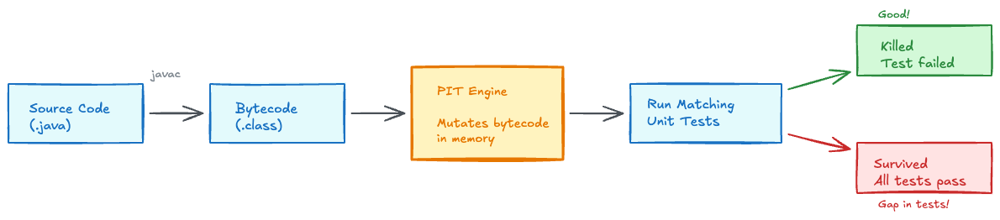
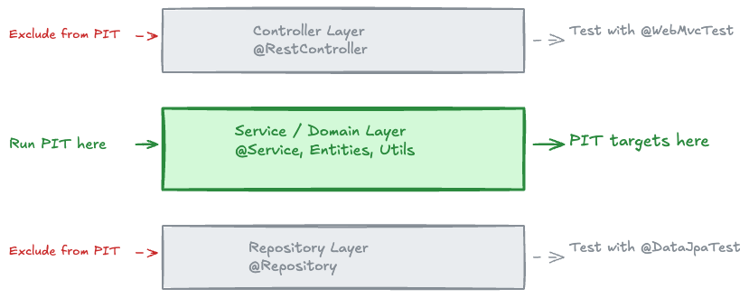
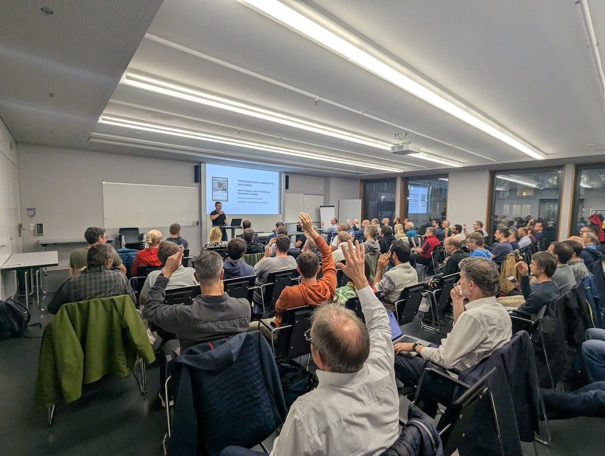
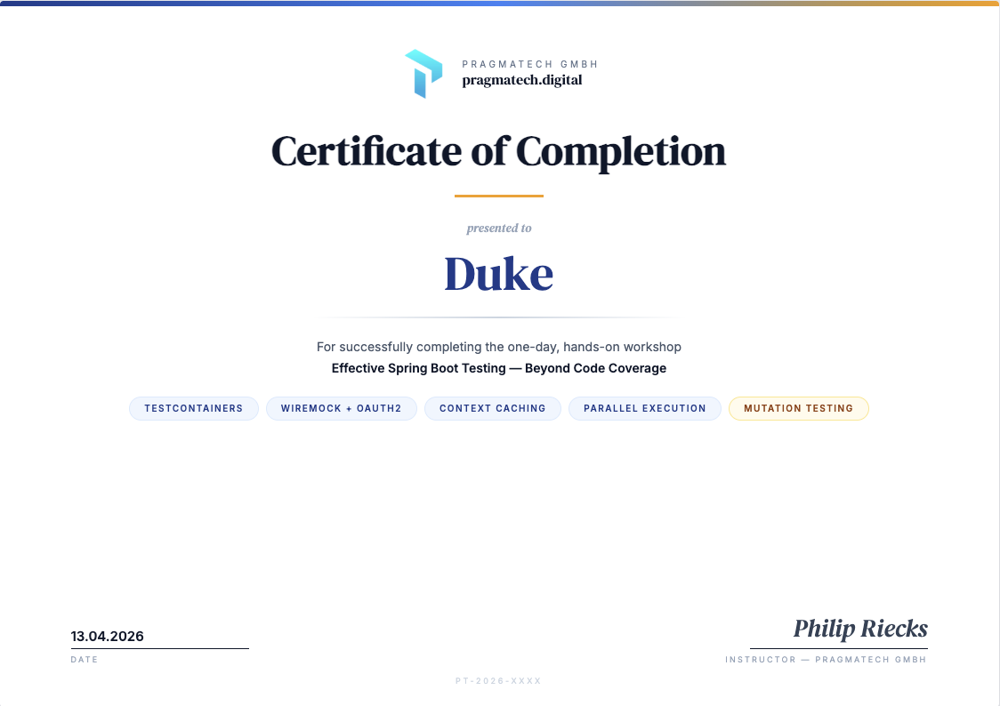

---

<!-- _class: title -->


# Effective Spring Boot Testing Beyond Code Coverage


## Full-Day Workshop

_Spring I/O Conference Workshop 13.04.2026_

Philip Riecks - [PragmaTech GmbH](https://pragmatech.digital/) - [@rieckpil](https://x.com/rieckpil)

---

<!-- header: 'Effective Spring Boot Testing Beyond Code Coverage @ Spring I/0 2026' -->
<!-- footer: '' -->

## Discuss Exercises from Lab 3

- Analyzing test suite for context cache reuse:
  - How many unique `ApplicationContext` are created by the `ContextCacheKiller*IT` tests?
  - Streamline the context setup with a shared class
  - Verify that all tests share the same context and build time is reduced

---


# Lab 4

## Tips & Tricks beyond Code Coverage

  
---

## Code Coverage Is a Vanity Metric


The moment you make code coverage a **KPI**, you change what people optimise for.

- Target is 80%? Teams write tests **to reach 80%**, not to catch bugs
- The easiest lines to cover are the ones that matter least (getters, constructors, config)
- The hardest lines to cover are the ones that matter most (error paths, race conditions, edge cases)
- Coverage rewards **quantity of execution**, not **quality of verification**

---

## What happens in Practice

| Shortcut | Coverage effect | Confidence effect |
|---|---|---|
| Tests with no assertions | Coverage goes up | Zero |
| Happy-path-only tests | Coverage goes up | Misses every edge case |
| Excluding hard-to-test code from reports | Coverage goes up | Hides the riskiest code |
| Duplicating test data across scenarios | Coverage stays the same | Wastes effort, tests nothing new |

> If our coverage number is our goal, we will hit the number. We will **not** necessarily ship software with confidence.


---

**Coverage is a good negative metric, but a bad positive one:**
- **30% coverage?** We *know* large parts of our code are untested - act on it
- **90% coverage?** We know *nothing* - those tests might all be assertionless

Use coverage to find what's **definitely not tested**. 

Never use it to claim what **is safe**.

---

## Why Code Coverage Lies

- JaCoCo measures **lines executed**, not **behavior verified**
- Remove every assertion from your tests - coverage stays at 100%

```java
@Test
void shouldReturnFeeWhenBookIsOverdue() {
  BigDecimal fee = cut.calculateFee(borrowedBook, sevenDaysAgo);
  // No assertion at all — JaCoCo still reports this line as "covered"
}
```

- 100% line coverage + zero assertions = **zero confidence**
- We need a tool that checks whether tests actually **detect bugs**

---


## Introducing: Mutation Testing

---


---

## What Is Mutation Testing?

- [PIT](https://pitest.org/) **injects small bugs** (mutants) into our compiled code, then reruns our tests
- **Killed** - at least one test fails, the test suite detected the bug
- **Survived** - all tests still pass, exposing a **gap** in our assertions
- **Mutation Score** = `killed mutants / total mutants x 100`

---

## How PIT Works Internally



1. Analyses **bytecode** of production classes (never touches source)
2. Collects per-test line coverage, selects only **matching tests** per mutant
3. Executes relevant tests for each mutant

---

## Our Upcoming Example

```java
@Service
public class LateReturnFeeCalculator {

  private static final BigDecimal RATE_TIER_ONE = new BigDecimal("1.00");
  private static final BigDecimal RATE_TIER_TWO = new BigDecimal("2.00");

  public BigDecimal calculateFee(Book book, LocalDate borrowedDate) {
    if (book.getStatus() != BookStatus.BORROWED) {
      return BigDecimal.ZERO;
    }

    LocalDate today = LocalDate.now(clock);
    long daysOverdue = ChronoUnit.DAYS.between(borrowedDate, today);

    if (daysOverdue <= 0) {
      return BigDecimal.ZERO;
    } else if (daysOverdue <= 7) {
      return RATE_TIER_ONE.multiply(BigDecimal.valueOf(daysOverdue));
    } else {
      return RATE_TIER_TWO.multiply(BigDecimal.valueOf(daysOverdue));
    }
  }
}
```

---

## PIT Default Mutators

| Mutator | What it does | `LateReturnFeeCalculator` example |
|---|---|---|
| Conditionals Boundary | `<=` to `<` | `daysOverdue <= 7` becomes `daysOverdue < 7` |
| Negate Conditionals | `!=` to `==` | `status != BORROWED` becomes `status == BORROWED` |
| Math | `*` to `/`, `+` to `-` | `RATE.multiply(days)` → conceptually division |
| Return Values | non-null to null, 0 to 1 | `return fee` → `return BigDecimal.ZERO` |
| Void Method Calls | removes the call entirely | removes void method invocations |
---

## PIT with Spring Boot & Maven In Action

```xml
<plugin>
  <groupId>org.pitest</groupId>
  <artifactId>pitest-maven</artifactId>
  <version>1.19.1</version>
  <!-- ... -->
</plugin>
```

```bash
./mvnw test-compile org.pitest:pitest-maven:mutationCoverage
# Report: target/pit-reports/index.html
```

---

## Demo: Weak Test - 100% Coverage, Mutants Survive

```java
@Test
void shouldReturnFeeWhenBookIsOverdue() {
  Book book = BookMother.borrowedBook();
  LocalDate borrowedDate = LocalDate.now(clock).minusDays(10);

  BigDecimal fee = cut.calculateFee(book, borrowedDate);

  assertThat(fee).isNotNull();                    // weak: any non-null passes
  assertThat(fee).isInstanceOf(BigDecimal.class);  // meaningless
}
```

**PIT:** 8 of 12 mutants **survive**
- `<= 7` mutated to `< 7` — tests still pass
- `RATE_TIER_TWO` replaced with `RATE_TIER_ONE` — tests still pass
- Return value replaced with `BigDecimal.ZERO` — tests still pass

---

## Reading PIT Reports

Open `target/pit-reports/index.html` after each run.

| Color | Meaning | Action |
|---|---|---|
| **Green line** | Mutant killed | Tests caught the injected bug |
| **Red line** | Mutant survived | **Add or strengthen a test** |
| **Light green** | Covered, no mutation applicable | No action needed |
| **No highlight** | Not covered by any test | Add coverage first |

**Focus on:** survived mutants in **business logic** (service, domain)

**Ignore:** survived mutants in DTOs, getters/setters, logging, configuration

---

## PIT in a Spring Boot Project



**Target:** `@Service` classes, domain entities with logic, utility classes

---

## CI Integration & Adoption Strategy

**Don't run PIT on every push** — it's 5-20x slower than a normal test run.

**Phase 1 — Local exploration**
```bash
./mvnw test-compile org.pitest:pitest-maven:mutationCoverage
```

**Phase 2 — Nightly CI** (full codebase scan, upload report as artifact)

**Phase 3 — PR-scoped** (only mutate changed files, much faster)
```bash
./mvnw test-compile org.pitest:pitest-maven:scmMutationCoverage
```

**Performance tuning:**
- `<threads>4</threads>` — parallel mutant execution
- `<avoidCallsTo>org.slf4j,org.apache.logging</avoidCallsTo>` — skip logging mutants
- `<mutationThreshold>80</mutationThreshold>` — fail build below threshold

---

## ArchUnit - Architecture Testing

**What is it?** A Java library that lets you write **executable architecture rules** as unit tests.

**Why does it matter?**

| Without ArchUnit | With ArchUnit |
|---|---|
| Architecture documented in ADRs/wikis | Architecture enforced in CI |
| Violations discovered in code review | Violations fail the build immediately |
| "Soft" conventions | Hard rules with clear error messages |

**No Spring context required** - ArchUnit analyzes the compiled bytecode.

---

## Adding ArchUnit to Our Project

```xml
<dependency>
  <groupId>com.tngtech.archunit</groupId>
  <artifactId>archunit-junit5</artifactId>
  <version>1.3.0</version>
  <scope>test</scope>
</dependency>
```

---

## ArchUnit - Code Examples

```java
@AnalyzeClasses(
  packages = "pragmatech.digital.workshops.lab4",
  importOptions = ImportOption.DoNotIncludeTests.class
)
class ArchUnitTest {

  @ArchTest
  static final ArchRule layeredArchitectureRuleShouldBeRespected = layeredArchitecture()
    .consideringAllDependencies()
    .layer("Controller").definedBy("..controller..")
    .layer("Service").definedBy("..service..")
    .layer("Repository").definedBy("..repository..")
    .whereLayer("Controller").mayNotBeAccessedByAnyLayer()
    .whereLayer("Service").mayOnlyBeAccessedByLayers("Controller")
    .whereLayer("Repository").mayOnlyBeAccessedByLayers("Service");

  @ArchTest
  static final ArchRule classesShouldNotCallLocalDateNowDirectly = noClasses()
    .that().resideOutsideOfPackage("..service..")
    .and().resideInAPackage("pragmatech.digital.workshops.lab4..")
    .should().callMethod(LocalDate.class, "now");
}
```
---

## Useful Libraries: Pact / Spring Cloud Contract

**Consumer-Driven Contract Testing** - verify both sides of an API independently.

```text
Consumer (Frontend/Client)          Provider (Backend)
         │                                  │
         ▼                                  ▼
  Write Pact contract            Verify contract against
  (defines expected API)         real implementation
         │                                  │
         └──── Pact Broker / shared file ───┘
```

**Spring Cloud Contract** (for Spring-to-Spring):

```groovy
Contract.make {
  request { method 'GET'; url '/api/books/1' }
  response { status 200; body(id: 1, title: "Effective Java") }
}
```
---

## TDD with AI: CLAUDE.md Conventions

Define your testing conventions in `.claude/CLAUDE.md` to guide AI code generation:

```markdown
## Test Code Conventions
- Use JUnit 5 + AssertJ for all tests
- Name methods: shouldExpectedBehaviorWhenCondition
- Use Arrange-Act-Assert pattern
- Mock external dependencies with @MockitoBean
- Group related tests with @Nested
- Use parameterized tests for boundary values
- Use Clock injection, never LocalDate.now() directly

... more conventions ...
```

---

**AI-assisted TDD workflow:**

1. Describe the class under test and its contract in plain language
2. Ask AI to write tests first (following CLAUDE.md conventions)
3. Review and commit tests
4. Ask AI to write minimal implementation to make tests pass
5. Run PIT to check mutation coverage

---

<!-- _class: section -->

# Confidence in Every Commit

## Beyond Tests: The Full Feedback Loop

---

## Tests Are Necessary - But Not Sufficient

A green test suite tells you the code is correct. It does not tell you the system is healthy in production.

**Confidence in every commit** requires closing the loop after deployment:

| Layer | Question answered |
|---|---|
| Tests | Does the code behave as intended? |
| Observability | Is the running system healthy right now? |
| Deployment strategy | Can we release without risk or downtime? |
| Feature flags | Can we decouple release from deployment? |
| Recovery automation | Can we self-heal without human intervention? |

---

## Meaningful Alerts & Developer-Friendly Observability

Alerts that fire on every small spike train developers to ignore them - alert on **symptoms that affect users**, not raw metrics.

**MDC (Mapped Diagnostic Context)** enriches every log line with request-scoped metadata so developers can trace a single request across thousands of log lines:

```java
// Set once per request (e.g. in a filter or interceptor)
MDC.put("tenantId", tenantId);
MDC.put("userId",   userId);
MDC.put("traceId",  traceId);

// Every subsequent log line automatically includes these fields
log.info("Book created");
// → {"tenantId":"test","userId":"u42","traceId":"abc123","message":"Book created"}
```

---

**Good observability checklist:**
- Structured JSON logs (Logback + `logstash-logback-encoder`) shipped to a central store
- Dashboards scoped to **error rate**, **p99 latency**, and **business KPIs** - not CPU graphs
- [Runbooks](https://github.com/stratospheric-dev/stratospheric/tree/main/docs/runbooks) linked directly from alert notifications

---

## Automated Deployments & Rollback

Manual deployments introduce human error and slow incident recovery. Every deployment step should be automated and every deployment should be reversible in under five minutes.

**Deployment pipeline essentials:**

```text
commit → CI (tests pass) → build image → push to registry
    → deploy to DEV (smoke test)
    → deploy to QA  (E2E / nightly)
    → deploy to PROD (blue/green swap or rolling update)
              │
              └── automated rollback if health check fails
```

---

## Blue/Green & A/B Deployments

**Blue/green** eliminates downtime and provides instant rollback: run two identical environments, flip the load balancer, keep the old environment warm.

```text
              Load Balancer
                   │
         ┌─────────┴─────────┐
         ▼                   ▼
    Blue (v1.2)         Green (v1.3)  ← new version deployed here
    [100% traffic]      [0% traffic, health checked]
                             │
                 swap: Green gets 100%, Blue stays warm
                             │
              rollback = swap back in < 1 minute
```

---

**A/B testing** routes a percentage of real traffic to the new version before a full rollout:

```text
100% traffic → v1.2 (control)
  ↓
10% traffic  → v1.3 (variant)   ← measure conversion, errors, latency
90% traffic  → v1.2 (control)
  ↓
100% traffic → v1.3 (if metrics OK)
```

Requires feature-flag or traffic-splitting infrastructure (Nginx, Istio, AWS ALB, LaunchDarkly).

---

## Feature Flags: Decouple Deployment from Release

**Deployment** = shipping code to production. 
**Release** = making a feature visible to users. 

Feature flags let you do both independently.

```java
if (featureFlags.isEnabled("new-book-search", userId)) {
  return newBookSearchService.search(query);
} else {
  return legacyBookSearchService.search(query);
}
```

---

**What this enables:**

| Scenario | Without flags | With flags                            |
|---|---|---------------------------------------|
| Half-finished feature | Block PR until done | Merge behind flag, release when ready |
| Risky refactor | Full rollout or nothing | Canary: enable for 1% of users        |
| Incident response | Redeploy to revert | Flip flag - instant, no deploy        |
| Beta testing | Separate branch | Enable flag for specific tenants      |

**Tooling options:** LaunchDarkly · Unleash (open source) · Spring Boot `@ConditionalOnProperty` for internal flags

---

## Recovery Automation

The goal is not zero failures - it is **fast, automatic recovery** when failures occur.

**Recovery patterns to implement:**

| Pattern | What it handles |
|---|---|
| Liveness probe restart | JVM deadlock, infinite loop |
| Readiness probe traffic cut | Slow startup, warming up caches |
| Circuit breaker (Resilience4j) | Downstream service unavailable |
| Retry with exponential backoff | Transient network errors |
| Dead-letter queue | Failed async message processing |

---

# Workshop Summary

## Lab 1 

- TBD

---

## Lab 2

- TBD

---

## Lab 3

- TBD

---

## Lab 4

- TBD 
---


## Time for General Q&A

- Do you have any questions about the exercises, the solutions, or the general testing tips and libraries we covered?
- Are there any specific testing challenges you've faced in your projects that you'd like to discuss?
- Would you like to see a live demo of any of the tools or techniques we covered?


---

## Level Up Your Organization On Spring Boot Testing



Testing is a team sport, make sure your whole team levels up together.

I offer the 90 minutes talk **Testing Spring Boot Applications Demystified** for free during:

- **Lunch & Learn** sessions
- **Internal conferences** and developer days
- **Team training** events

Reach out via LinkedIn or email (philip@pragmatech.digital) to discuss the details and schedule a session for your team.

---

## Upcoming Open Online Workshops

Join developers from all around the world in a public, hands-on cohort:

**Confidence In Every Commit: Essentials (1 Day)** — Achieve confidence in every commit. Stop fighting your test suite and start mastering it.
  - 🗓️ 02.07.2026
  - 🗓️ 08.09.2026

Dates, agendas and tickets: **<https://rieckpil.de/workshops>**

---

## Get Your Certificate of Participation



**To claim your personalised certificate:**

- Send a short email to **philip@pragmatech.digital**
with your **full name**.
- You'll get the signed PDF back within a day.

---

<!-- paginate: false -->

## Jofyul Testing!

Enjoy the upcoming two days of Spring I/O 2026 and sunny Barcelona!


  
Reach out any time via:
- [LinkedIn](https://www.linkedin.com/in/rieckpil) (Philip Riecks)
- [X](https://x.com/rieckpil) (@rieckpil)
- [Mail](mailto:philip@pragmatech.digital) (philip@pragmatech.digital)


